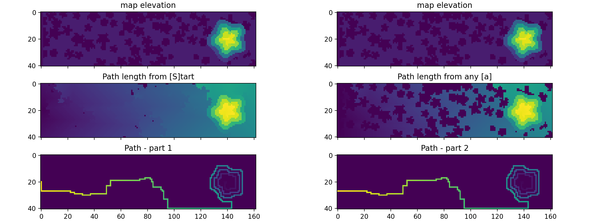

## Advent of Code 2022 solutions

This year I'm trying to solve some tasks in Rust.
Since using cargo is simpler than the compiler directly, the sources are in a separate `src` directory.

Running:

```
$ python d1.py
$ cargo run --bin day01
```

Both programs should give the same results.

## vizualizations

During day 12 ("Hill Climbing Algorithm"),
where pretty-printing was _not_ helpful enough,
I made a plot of the solutions:


